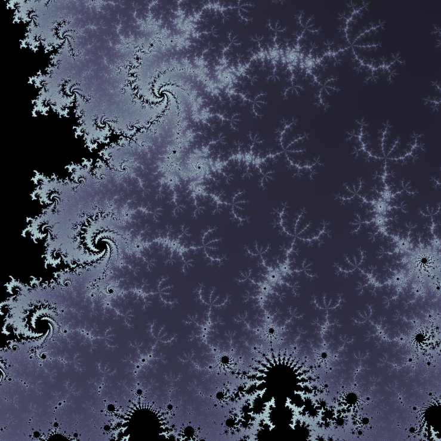
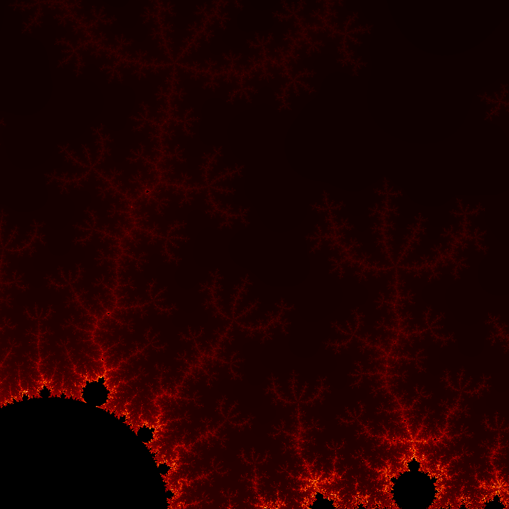

# Mandelbrot

Computes fractal images by the Mandelbrot set, built using NumPy and designed to handle large resolutions.

The Python script is run through the command line `python3 mandelbrot.py` and takes the maximum number of iterations (before diverging) and the square grid length as inputs.

# Gallery

(100 iterations, 3000 x 3000, ~27 seconds to generate)

(100 iterations, 6000 x 6000, ~111 seconds to generate)

(1000 iterations, 1000 x 1000, ~29 seconds to generate)

(1000 iterations, 2000 x 2000, ~114 seconds to generate)

